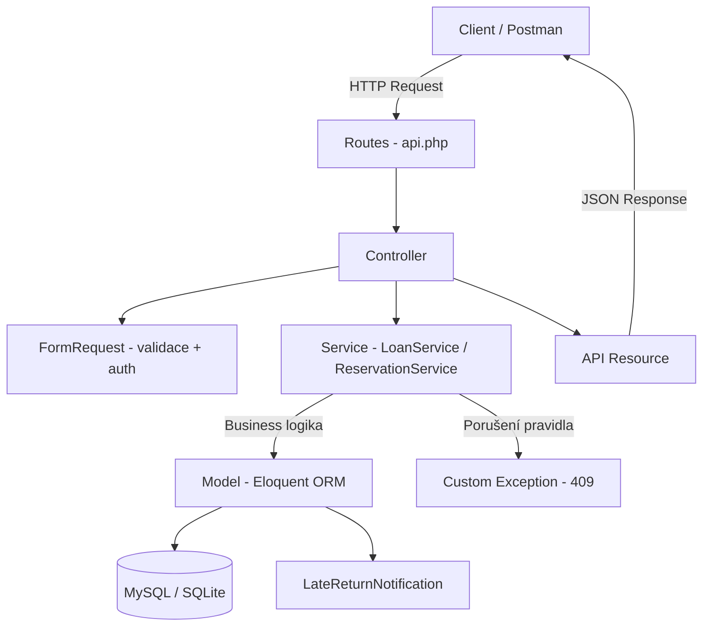
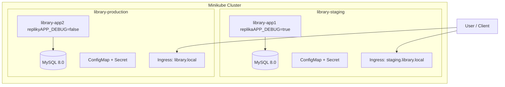
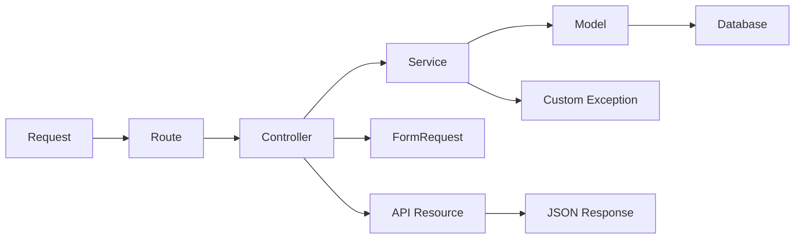
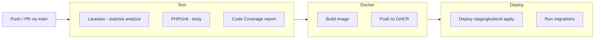

# Library App – Půjčovna knih (REST API)

Semestrální práce – REST API pro správu půjčovny knih vyvinuté v Laravel s využitím TDD, Git, CI/CD, kontejnerizace a Kubernetes.

- **BTDD/KTDD** – Programování řízené testy (TDD, testovací strategie, mocking)
- **DevOps** – CI/CD pipeline, Docker, Kubernetes, Kustomize

---

## Popis domény

Aplikace simuluje knihovní systém, kde uživatelé (čtenáři) si mohou půjčovat a rezervovat knihy, a knihovníci spravují katalog. Systém vynucuje business pravidla jako limity výpůjček, pokuty za pozdní vrácení a prioritu rezervací.

### Entity

- **User** – uživatel s rolí `reader` (čtenář) nebo `librarian` (knihovník)
- **Book** – kniha s evidencí celkového a dostupného počtu výtisků
- **Loan** – výpůjčka se stavy `borrowed` → `returned`
- **Reservation** – rezervace se stavy `active` → `fulfilled` / `expired` / `cancelled`

### Business pravidla

1. Uživatel může mít maximálně 3 aktivní výpůjčky současně
2. Knihu nelze půjčit, pokud žádný výtisk není dostupný
3. Uživatel s nezaplacenou pokutou si nemůže půjčit další knihu
4. Při pozdním vrácení se automaticky vypočítá pokuta (10 Kč/den prodlení, lhůta 14 dní)
5. Rezervace expiruje po 3 dnech
6. Knihu nelze půjčit jinému uživateli, pokud na ni existuje aktivní rezervace
7. Validace stavových přechodů – výpůjčku nelze vrátit dvakrát, zrušenou rezervaci nelze znovu aktivovat
8. Knihovník může označit pokutu jako zaplacenou, uživatel pak může opět půjčovat

---

## Architektura

### Diagram komponent



### Diagram nasazení (Kubernetes)



### Vrstvy aplikace



- **Controller** – přijímá HTTP request, volá service, vrací JSON response
- **Service** – obsahuje business logiku a pravidla, vyhazuje custom výjimky
- **Model** – Eloquent ORM, vztahy, scopes, jednoduché helper metody
- **Request** – validace vstupů a autorizace (role-based)
- **Resource** – transformace modelu na konzistentní JSON odpověď
- **Exception** – custom výjimky pro business pravidla (409 Conflict)

### Adresářová struktura

```
app/
├── Models/              # Eloquent modely (Book, User, Loan, Reservation)
├── Services/            # Business logika (LoanService, ReservationService)
├── Http/
│   ├── Controllers/Api/ # REST API controllery
│   ├── Requests/        # Form Request validace
│   └── Resources/       # API Resource transformace
├── Exceptions/          # Custom výjimky (BusinessRule violations)
└── Notifications/       # Email notifikace (LateReturnNotification)

k8s/
├── base/                # Společné Kubernetes manifesty
│   ├── deployment.yaml
│   ├── service.yaml
│   ├── mysql-deployment.yaml
│   ├── configmap.yaml
│   ├── secrets.yaml
│   ├── ingress.yaml
│   └── kustomization.yaml
└── overlays/
    ├── staging/         # Staging override (1 replika, debug=true)
    └── production/      # Production override (2 repliky, debug=false)

docker/
├── nginx.conf           # Nginx konfigurace
└── supervisord.conf     # Supervisor (nginx + php-fpm)
```

---

## Spuštění projektu

### Požadavky

- PHP 8.4+
- Composer
- Git
- Docker Desktop
- Minikube + kubectl (pro Kubernetes)

### Varianta 1: Lokálně (SQLite)

```bash
git clone https://github.com/HasekOn/Library-app.git
cd Library-app
composer install
cp .env.example .env
php artisan key:generate
touch database/database.sqlite
php artisan migrate
php artisan serve
# API dostupné na http://localhost:8000/api
```

### Varianta 2: Docker Compose (MySQL)

```bash
git clone https://github.com/HasekOn/Library-app.git
cd Library-app
cp .env.example .env
php artisan key:generate
docker compose up --build
# Po startu:
docker compose exec app php artisan migrate --force
# API dostupné na http://localhost:8080/api
```

### Varianta 3: Kubernetes (Minikube)

```bash
# Spuštění clusteru
minikube start --driver=docker

# Nasazení staging
kubectl apply -k k8s/overlays/staging
kubectl exec deployment/staging-library-app -n library-staging -- php artisan migrate --force

# Nasazení production
kubectl apply -k k8s/overlays/production
kubectl exec deployment/prod-library-app -n library-production -- php artisan migrate --force

# Přístup k staging API
kubectl port-forward service/staging-library-app -n library-staging 8080:80
# API dostupné na http://localhost:8080/api

# Přístup k production API
kubectl port-forward service/prod-library-app -n library-production 8081:80
# API dostupné na http://localhost:8081/api
```

---

## Prostředí (Staging vs Production)

| Vlastnost        | Staging               | Production                     |
|------------------|-----------------------|--------------------------------|
| Namespace        | `library-staging`     | `library-production`           |
| Repliky aplikace | 1                     | 2                              |
| APP_ENV          | staging               | production                     |
| APP_DEBUG        | true                  | false                          |
| Ingress host     | staging.library.local | library.local                  |
| Prefix zdrojů    | `staging-`            | `prod-`                        |
| Účel             | Testování a ověření   | Simulované produkční prostředí |

Konfigurace prostředí je řízena přes **Kustomize overlays** – base manifesty jsou sdílené, rozdíly jsou definovány v overlay souborech.

---

## API Endpointy

### Books (veřejné čtení, zápis jen librarian)

| Metoda | Endpoint          | Popis             | Auth      |
|--------|-------------------|-------------------|-----------|
| GET    | `/api/books`      | Seznam všech knih | Ne        |
| GET    | `/api/books/{id}` | Detail knihy      | Ne        |
| POST   | `/api/books`      | Vytvořit knihu    | Librarian |
| PUT    | `/api/books/{id}` | Upravit knihu     | Librarian |
| DELETE | `/api/books/{id}` | Smazat knihu      | Librarian |

### Loans (vyžaduje přihlášení)

| Metoda | Endpoint                   | Popis                    | Auth      |
|--------|----------------------------|--------------------------|-----------|
| GET    | `/api/loans`               | Moje výpůjčky            | Reader    |
| POST   | `/api/loans`               | Půjčit knihu (`book_id`) | Reader    |
| PATCH  | `/api/loans/{id}/return`   | Vrátit knihu             | Reader    |
| PATCH  | `/api/loans/{id}/pay-fine` | Zaplatit pokutu          | Librarian |

### Reservations (vyžaduje přihlášení)

| Metoda | Endpoint                        | Popis                        |
|--------|---------------------------------|------------------------------|
| GET    | `/api/reservations`             | Moje rezervace               |
| POST   | `/api/reservations`             | Rezervovat knihu (`book_id`) |
| PATCH  | `/api/reservations/{id}/cancel` | Zrušit rezervaci             |

### HTTP kódy odpovědí

| Kód | Význam                                |
|-----|---------------------------------------|
| 200 | OK (úspěšný update/list)              |
| 201 | Created (nový záznam)                 |
| 204 | No Content (delete)                   |
| 401 | Unauthorized (nepřihlášený)           |
| 403 | Forbidden (nedostatečná role)         |
| 404 | Not Found                             |
| 409 | Conflict (porušení business pravidla) |
| 422 | Validation Error (neplatná data)      |

---

## TDD (Test-Driven Development)

### Cyklus Red → Green → Refactor

Celý vývoj probíhal metodou TDD, viditelnou v git historii:

1. **RED** `test(red):` – napíšu test, který selže (třída/metoda ještě neexistuje)
2. **GREEN** `feat(green):` – napíšu minimální kód, aby test prošel
3. **REFACTOR** `refactor:` – vylepším kód bez změny chování

Příklad z git logu:
```
test(red): add Book model tests - creation and availability check
feat(green): add Book model, migration, factory with isAvailable method
refactor: add attribute casts to Book model
```

### Testovací strategie

**Feature (integrační) testy** – ověřují celý flow od HTTP requestu přes controller, service až po databázi. Používají `RefreshDatabase` trait. Příklady: `BookApiTest`, `LoanApiTest`, `ReservationApiTest`.

**Doménové testy** – testují business pravidla přes service vrstvu s reálnou databází. Příklady: `LoanTest`, `LoanFineTest`, `ReservationTest`, `FinePaymentTest`.

**Model testy** – ověřují správné chování modelů, factory a helper metod. Příklady: `BookTest`, `UserTest`.

### Spuštění testů

```bash
# Všechny testy
php artisan test

# S code coverage (vyžaduje Xdebug)
php artisan test --coverage

# Konkrétní test suite
php artisan test --filter=LoanTest
php artisan test --filter=FinePaymentTest
```

### Mocking a test doubles

| Co                                        | Typ              | Proč                                                                   |
|-------------------------------------------|------------------|------------------------------------------------------------------------|
| `Notification::fake()`                    | Fake             | Nechceme reálně odesílat emaily, ale ověřujeme že se notifikace odešle |
| `$this->freezeTime()` / `$this->travel()` | Mock času        | Testování pokut a expirace vyžaduje kontrolu nad časem                 |
| `$this->actingAs($user)`                  | Stub autentizace | Simulujeme přihlášeného uživatele bez reálného auth flow               |
| `User::factory()` / `Book::factory()`     | Factory pattern  | Generování testovacích dat s kontrolovanými atributy                   |

### Co se nemockuje a proč

Databáze se nemockuje – používáme in-memory SQLite (`DB_DATABASE=:memory:` v `phpunit.xml`), protože chceme ověřit reálnou interakci s databází (ORM, migrace, constraints). Testy jsou díky in-memory DB stále rychlé.

### FIRST princip

- **Fast** – in-memory SQLite, žádné externí závislosti
- **Independent** – `RefreshDatabase` zajišťuje izolaci (každý test má čistou DB)
- **Repeatable** – `freezeTime()` eliminuje nedeterminismus
- **Self-validating** – jasné `assertTrue` / `assertEquals`
- **Timely** – testy psány PŘED implementací (TDD)

---

## CI/CD Pipeline

### Přehled



Soubor: `.github/workflows/ci.yml`

### Job: test
- Setup PHP 8.4 + Xdebug
- Composer install
- Příprava prostředí (.env, SQLite, migrace)
- **Larastan** – statická analýza (quality gate, level 5)
- **PHPUnit** – všechny testy
- **Code coverage** report (artefakt, cíl ≥ 70 %)

### Job: docker (po úspěšných testech, jen na main)
- Build Docker image (multi-stage)
- Push do **GitHub Container Registry** (`ghcr.io`)
- Tagování: SHA commit + `latest`

### Job: deploy_staging (po úspěšném Docker buildu, jen na main)
- Konfigurace kubectl přes `KUBE_CONFIG` secret
- `kubectl apply -k k8s/overlays/staging`
- Čekání na rollout
- Spuštění migrací

---

## Kontejnerizace

### Dockerfile (multi-stage build)

1. **Stage 1 (builder)** – `composer:2` image, instalace závislostí, optimalizace autoloaderu
2. **Stage 2 (production)** – `php:8.4-fpm-alpine`, nginx + supervisor, kopie aplikace z builderu

Vlastnosti:
- Reprodukovatelný build (závislosti cachovány v první stage)
- Malý finální image (Alpine Linux)
- Spuštění pod non-root uživatelem (`appuser`)
- Healthcheck (`/api/books` endpoint)

### Docker Compose (lokální vývoj)

```bash
docker compose up --build
```

Služby:
- **app** – Laravel aplikace (port 8080)
- **db** – MySQL 8.0 (port 3306) s health check a persistent volume

---

## Kubernetes

### Manifesty (Kustomize)

| Zdroj      | Soubor                  | Popis                                     |
|------------|-------------------------|-------------------------------------------|
| Namespace  | `namespace.yaml`        | Izolace prostředí                         |
| Deployment | `deployment.yaml`       | Laravel app s liveness/readiness probes   |
| Deployment | `mysql-deployment.yaml` | MySQL 8.0 databáze                        |
| Service    | `service.yaml`          | ClusterIP pro app (port 80 → 8080)        |
| ConfigMap  | `configmap.yaml`        | Nekritická konfigurace (APP_ENV, DB_HOST) |
| Secret     | `secrets.yaml`          | Citlivé údaje (APP_KEY, DB_PASSWORD)      |
| Ingress    | `ingress.yaml`          | Externí přístup přes hostname             |

### Resource limity

| Kontejner   | CPU request | CPU limit | Memory request | Memory limit |
|-------------|-------------|-----------|----------------|--------------|
| library-app | 100m        | 500m      | 128Mi          | 256Mi        |
| mysql       | 200m        | 500m      | 256Mi          | 512Mi        |

### Přístup k aplikaci

```bash
# Port-forward (nejjednodušší)
kubectl port-forward service/staging-library-app -n library-staging 8080:80

# Nebo přes Ingress (vyžaduje minikube addons enable ingress)
minikube addons enable ingress
# + přidat do /etc/hosts: 127.0.0.1 staging.library.local library.local
```

---

## Bezpečnost (Secrets)

- **Repozitář**: žádné plaintext hesla/tokeny v kódu. `.env` je v `.gitignore`.
- **Kubernetes**: citlivé údaje (APP_KEY, DB_PASSWORD, MYSQL_ROOT_PASSWORD) jsou v `Secret` objektech
- **CI/CD**: `GITHUB_TOKEN` pro push do Container Registry, `KUBE_CONFIG` pro deployment – uloženy jako GitHub Secrets
- **Docker**: aplikace běží pod non-root uživatelem (`appuser`)

---

## Bonusová rozšíření

### Statická analýza (Larastan)

Projekt používá Larastan (PHPStan pro Laravel) na úrovni 5 jako quality gate v CI pipeline. Analýza běží automaticky při každém push a pipeline selže, pokud kód obsahuje chyby.

```bash
vendor/bin/phpstan analyse --memory-limit=512M
```

### Notifikace

Při pozdním vrácení knihy systém automaticky odešle `LateReturnNotification` s informací o pokutě. Testováno pomocí `Notification::fake()`.

### Smoke test po deploy

Skript `scripts/smoke-test.sh` ověřuje funkčnost aplikace po nasazení do Kubernetes:
- GET `/api/books` vrací HTTP 200
- Response obsahuje validní JSON s klíčem `data`
- POST bez autentizace je odmítnut
```bash
bash scripts/smoke-test.sh library-staging staging-library-app 8080
```

### Infrastructure as Code (Terraform)

Terraform spravuje Kubernetes namespaces a resource quotas pro obě prostředí.
```bash
cd terraform
terraform init
terraform plan
terraform apply
```

Spravované zdroje:
- Namespaces (`library-staging`, `library-production`) s labely
- Resource quotas (limity CPU, paměti a počtu podů na namespace)

---

## Technologie

| Technologie    | Verze   | Účel                              |
|----------------|---------|-----------------------------------|
| PHP            | 8.4     | Runtime                           |
| Laravel        | 12      | Framework                         |
| MySQL          | 8.0     | Databáze (Docker/K8s)             |
| SQLite         | -       | Lokální vývoj a testy             |
| PHPUnit        | -       | Testovací framework               |
| Sanctum        | -       | API autentizace                   |
| Larastan       | level 5 | Statická analýza                  |
| Docker         | -       | Kontejnerizace                    |
| Kubernetes     | -       | Orchestrace                       |
| Kustomize      | -       | Správa K8s konfigurací            |
| Minikube       | -       | Lokální K8s cluster               |
| GitHub Actions | -       | CI/CD pipeline                    |
| Nginx          | -       | Web server (v kontejneru)         |
| Supervisor     | -       | Process manager (nginx + php-fpm) |

---

## Git Workflow

Projekt používá feature branch workflow:

- **main** – stabilní větev, deployuje se na staging/production
- **feature/*** – nové funkce (např. `feature/dockerize`, `feature/kubernetes`)
- **Merge** do main po dokončení feature

Commity používají konvenční formát:
- `feat:` – implementace (TDD green phase)
- `refactor:` – vylepšení kódu
- `fix:` – opravy bugů
